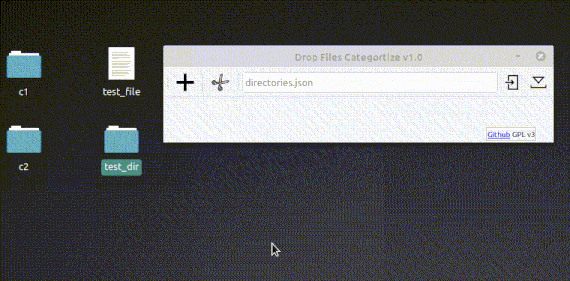
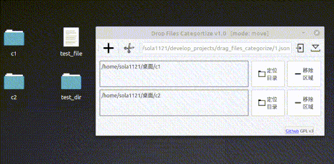
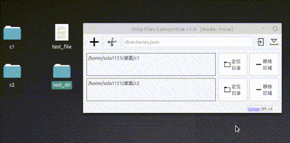

# Drag Files Categorize

通过拖拽文件分类到不同目录, 拯救乱糟糟的桌面.

Sort files to directories by drag and drop, save the mess desktop.

## 依赖 requirements

python >= 3.6, pyqt == 5.10

Running on Windows/Linux/macOS

## 启动 Run

    python3 main_run.py

## 使用 usage

### 拖拽分类文件 sort files by drag and drop

通过添加按钮, 添加一个拖拽区域, 并为这个拖拽区域指定目标目录,将文件或目录拖拽进拖拽区域, 就可以进行相应操作. 支持同时拖拽多个文件或目录. 这里一共有三个模式, 移动, 复制, 比较.

Click the plus button to add a drop area. At the area click the direcotry button to set the directory you want to throw files or directories in. Then drag files or directories in it. There are three modes can use, Move, Copy and Compare.

### 文件冲突 file conflict

如果在目标目录第一层中已有同名目录或文件了, 将会提示文件冲突. 可以选择覆盖, 或者重命名后在进行相关操作.

**注意**: 文件冲突只会检测目标目录的第一层是否有同名文件或目录, 如果移动的是目录, 进行覆盖的话将不会在检测目标目录中被覆盖的目录中是否还有同名的, 将会无提示覆盖.

If there is a same name file or directory with draged in destination directory. The file conflict dialog will be triggered. It's possible to rename or just cover the same.

**Note**: File conflict just check the first level of destination directory. It means if a dragging directory has some same name files or direectories with destination ones, the same files or directories will be covered implicitly.

### 保存定义好的分类目录 save directories

如果这些分类目录可能经常使用, 可以将这些路径地址保存到一个json文件中. 之后使用时可以载入导出的json文件.

If you want to use the destination directories repeatedly, you can export these directory paths to a json file. After you can also import these to reuse.

## 配置 config

### 目标目录保存文件 destination save json

储存配置好的目录的json文件 

the file saves destination directories exported

[directories.json](directories.json)

    {
        "auto_load": true,
        "paths_list": []
    }

auto_load : 启动时是否自动载入.

auto_load :  Whether auto load saved destination directory paths when start.

**注意**: 只会载入对应名字的同级目录下的目录配置. 对应ui_config.DIRECTORIES_CONFIG. 

**Note**: It just load from the same direcotry's. Configured in ui_config.DIRECTORIES_CONFIG

paths_list : 储存的目录列表.

paths_list : The list of destination directories.

### 应用表现 application performance config

[window/config.json](window/config.json)

    {
        "defaultDirectoriesConfig" : "directories.json",
        "historyLog" : false
    }

defaultDirectoriesConfig : 同上面的目标目录记录文件, 这个会重载ui_config.DIRECTORIES_CONFIG. 通过这个就可以指定应用启动时载入的目标目录配置文件.

defaultDirectoriesConfig : Corresponding above destination saved file, this will set the ui_config.DIRECTORIES_CONFIG value. Across this, you can define the destination directory saved json file's name that application start to load.

historyLog : 是否产生日志

historyLog : Whether log.

### 更多自定义 more configuration

可以定义窗口大小, 显示文字, 定义自己的样式.

Can define the width of window, font style, and others.

[window/ui_config.py](window/ui_config.py)
